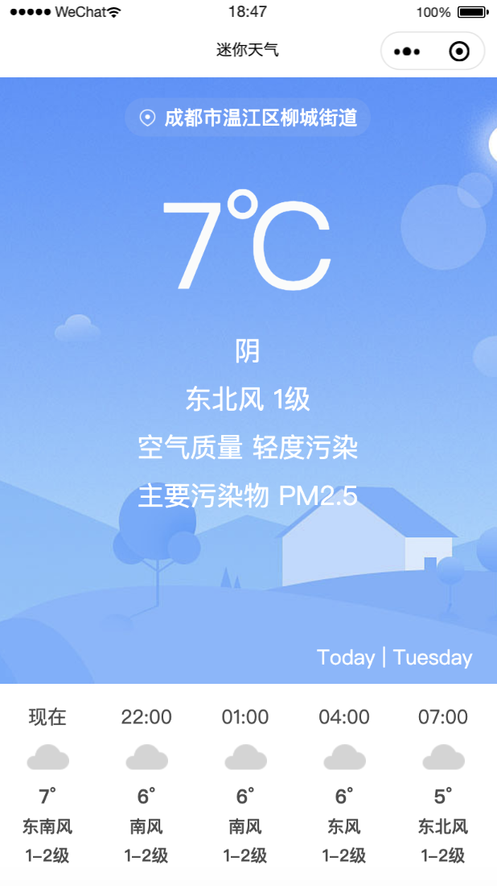
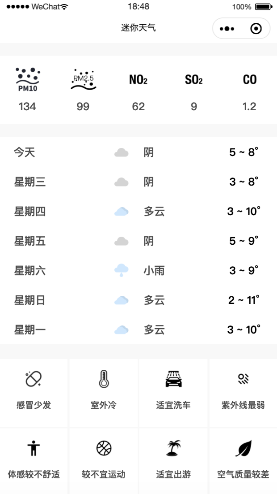
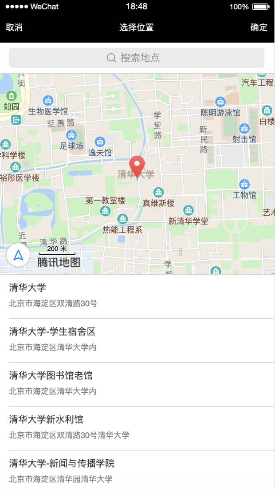

## 迷你天气

[](http://hits.dwyl.io/TimeGarage/TimeGarage/MiniWeather)&ensp; &ensp; &ensp; &ensp; 

### 项目介绍

迷你天气是一款微信小程序，由高德地图API根据经纬度提供地理位置信息，和风天气API提供气象数据。用户可以使用迷你天气获取实时、每小时和未来7天的气象信息，同时还可以查询空气质量和其它实用指数信息（如紫外线指数、运动指数和洗车指数等。

### 运行截图

  									

### 目录结构

```
├── LICENSE 
├── README.md
├── app.js
├── app.json
├── app.wxss
├── images4md            //运行截图
│   ├── Detail.png
│   ├── Hourly.png
│   └── Location.png
├── pages
│   ├── img
│   ├── index						 //展示页面
│   │   ├── index.js
│   │   ├── index.wxml
│   │   └── index.wxss
│   └── logs						 //日志输出
│       ├── logs.js
│       ├── logs.json
│       ├── logs.wxml
│       └── logs.wxss
├── project.config.json
├── sitemap.json
└── utils
    ├── network.js       
    └── util.js					 //日期转换

```

### 联系方式

个人博客：[「少数派报告」](https://www.timegarage.works)

Email：82610725@163.com

WeChat：DalePeng


